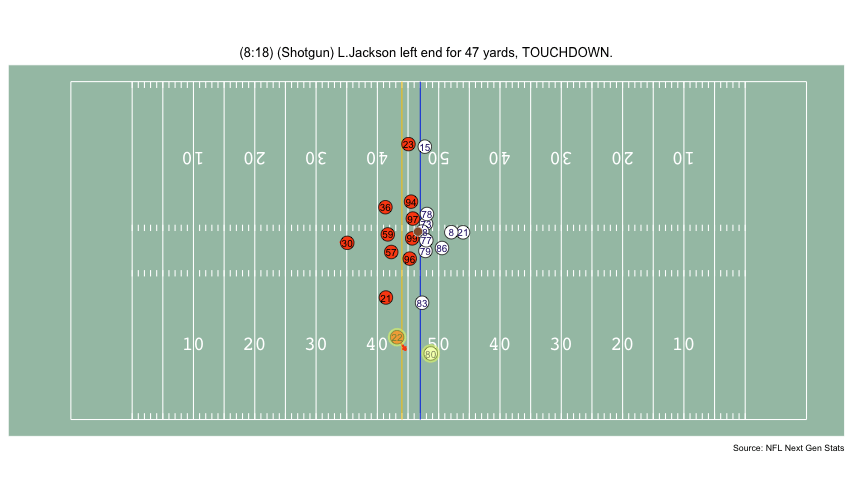

```{r setup, include=FALSE}
knitr::opts_chunk$set(echo = TRUE)
library(gt)
```
_This is meant to be a very simple introduction to working with the tracking data housed in this repo. For a more in-depth guide on working with the NFL's tracking data, check out [Mike Lopez's notebook](https://www.kaggle.com/statsbymichaellopez/nfl-tracking-wrangling-voronoi-and-sonars) from the most recent Big Data Bowl._

***
### Intro

Tracking data has been billed as "the future of sports analytics," but it's notoriously difficult to both acquire and use. This repo was created to help alleviate those issues; it contains tracking data from the NFL's Next Gen Stats (NGS) Highlights for 2017-2019 seasons, as well as a few Rscripts with helper functions to make it easier to work with the data.

In this walk-through, we will:  

- import an NGS Highlight play's tracking data  
- plot the frames from a play (with some extras)
- animate a play

***
### Setting Things Up

Before getting started with the data, we need to install and load a few libraries, as well as the Rscripts containing helper functions.
```{r install_dependencies, eval=F, message=F}
# * install packages ----
install.packages("devtools", "tidyverse")
devtools::install_github('thomasp85/ggforce')
devtools::install_github('thomasp85/gganimate')
```

```{r load_dependencies, message=F}
# * load packages ----
library(devtools)
library(dplyr)
library(gganimate)
library(ggforce)
library(ggplot2)
library(readr)
```

```{r load_scripts, message=F}
# * load helper functions ----
source_url("https://raw.githubusercontent.com/asonty/ngs_highlights/master/utils/scripts/data_utils.R")
source_url("https://raw.githubusercontent.com/asonty/ngs_highlights/master/utils/scripts/plot_utils.R")
```

***
### Importing the Data

#### Listing the Highlights

We can use the `fetch_highlights_list()` function to grab a list of the NGS Highlights in this repo, and by using the `team_` and `season_` arguments, we can filter the list down.

Lamar Jackson had some ridiculous plays during his MVP season, so let's look at the Ravens' highlights from 2019:
```{r fetch_highlights}
highlights <- fetch_highlights_list(team_ = "BAL", season_ = 2019)
```

```{r echo=F}
highlights %>% gt()
```

#### Importing the Tracking Data

The first column in the table (`playKey`) is a unique identifier for each play in the dataset, and is used by the `fetch_play_data()` function to grab the tracking data for a play. 
Let's take a look at Lamar Jackson's 47-yard touchdown run. The `playKey` for that play is `242`, so we'll provide that to `fetch_play_data()`.

```{r fetch_play_data}
play_data <- fetch_play_data(playKey_ = 242)
```

```{r echo=F}
play_data %>% head(5) %>% gt()
```
***
### Visualizing Plays

In my opinion, the most fun way to get started with tracking data is through visualizations. To that end, we can use the `plot_play_frame()` function to plot any given frame in a play.

It's important to note that the tracking data contains the entire runtime of the play, including all of the dead time prior to the line being set, and in some cases even the team celebrations after a touchdown is scored.  So let's first find the 'frame interval' of the play:

```{r find_frames}
first_frame <- play_data %>%
  filter(event == "line_set") %>% 
  distinct(frame) %>% 
  slice_max(frame) %>% 
  pull()

final_frame <- play_data %>% 
  filter(event == "tackle" | event == "touchdown" | event == "out_of_bounds") %>% 
  distinct(frame) %>% 
  slice_max(frame) %>% 
  pull()

first_frame
final_frame
```

#### Basic Play Frame Plot

Now that we've got a better idea of the interval in which the play takes place, let's visualize it.

```{r plot_frame}
plot_play_frame(play_data_ = play_data, frame_ = 180)
```

#### Play Frame Plot + Velocity Vectors

`plot_play_frame()` also has a `velocities_` parameter, which, when set to `TRUE`, adds the players' velocity vectors to the plot.

```{r plot_frame_vel}
plot_play_frame(play_data_ = play_data, frame_ = 200, velocities_ = T)
```

#### Play Frame Plot + Voronoi Tessellation

In past Big Data Bowls, some of the top submissions borrowed a concept from soccer called "pitch control." Pitch control models aim to quantify the areas of the field that players/teams control; an example of a basic pitch control model is Voronoi tessellation. We can use the `voronoi_` argument to add a Voronoi layer to play frame plots:

```{r plot_frame_vor}
plot_play_frame(play_data_ = play_data, frame_ = 220, velocities_ = F, voronoi_ = T)
```

The final in-built function we can use is `plot_play_sequence()`, which plots `n_` number of frames between a `first_frame_` and `final_frame_` at evenly spaced intervals:

```{r plot_play_seq, fig.height = 22, fig.width = 8, fig.align = "center"}
plot_play_sequence(play_data, first_frame_ = first_frame, final_frame_ = final_frame, n_=6, velocities_ = T, voronoi_ = T)
```

***
### Animating a Play

The next step in visualizing a play is animation. Rather than just animating the data as-is, let's transform it a bit. In our animation, we're going to highlight the fastest player on each team at every frame of the play. 

#### Data Manipulation

First, we'll reduce the dataset, split it up into player and ball data, and grab some details.
```{r data_cleaning}
# * reduce dataset ----
reduced_play_data <- play_data %>% filter(frame >= first_frame, frame <= final_frame+10)

# * get play details ----
play_desc <- reduced_play_data$playDescription %>% .[1]
play_dir <- reduced_play_data$playDirection %>% .[1]
yards_togo <- reduced_play_data$yardsToGo %>% .[1]
los <- reduced_play_data$absoluteYardlineNumber %>% .[1]
togo_line <- if(play_dir=="left") los-yards_togo else los+yards_togo

# * separate player and ball tracking data ----
player_data <- reduced_play_data %>% 
  select(frame, homeTeamFlag, teamAbbr, displayName, gsisId, jerseyNumber, position, positionGroup,
         x, y, s, o, dir, event) %>% 
  filter(displayName != "ball")
ball_data <- reduced_play_data %>% 
  select(frame, homeTeamFlag, teamAbbr, displayName, jerseyNumber, position, positionGroup,
         x, y, s, o, dir, event) %>% 
  filter(displayName == "ball")

# * get team details ----
h_team <- reduced_play_data %>% filter(homeTeamFlag == 1) %>% distinct(teamAbbr) %>% pull()
a_team <- reduced_play_data %>% filter(homeTeamFlag == 0) %>% distinct(teamAbbr) %>% pull()
#  call helper function to get team colors
team_colors <- fetch_team_colors(h_team_ = h_team, a_team_ = a_team)
h_team_color1 <- team_colors[1]
h_team_color2 <- team_colors[2]
a_team_color1 <- team_colors[3]
a_team_color2 <- team_colors[4]
```

Next, we'll compute the x and y component's of each player's velocity. Note that the `dir` variable specifies the direction of the player's movement; it is `0` degrees when the player is facing 'up' on the field (towards the far sideline) and increases in the clockwise direction.

```{r compute_vel_comp}
# * compute velocity components ----
#  velocity angle in radians
player_data$dir_rad <- player_data$dir * pi / 180

#  velocity components
player_data$v_x <- sin(player_data$dir_rad) * player_data$s
player_data$v_y <- cos(player_data$dir_rad) * player_data$s
```

Finally, we'll identify the fastest players on each team in every frame, and merge that information with our `player_data`:

```{r id_fastest_players}
#  there are assuredly better ways to do this

# * identify the fastest player from each team at each frame ----
fastest_players <- player_data %>% # filter out ball-tracking data
  group_by(frame, teamAbbr) %>% # group by frame and team
  arrange(s) %>% top_n(s, n=1) %>% # take only the players with the highest speed on each team at every frame
  mutate(isFastestFlag = 1) %>% # create new flag identifying fastest players
  ungroup() %>% 
  select(frame, gsisId, isFastestFlag) %>%  # reduce dataset to the columns needed for joining and the new flag
  arrange(frame) # sort by frame

player_data <- player_data %>% 
  left_join(fastest_players, by = c("frame" = "frame", "gsisId" = "gsisId")) %>% # join on frame and gsisId
  mutate(isFastestFlag = case_when(is.na(isFastestFlag) ~ 0, TRUE ~ 1)) # replace NA values for isFastestFlag with 0

```

#### Animating the Play

Unfortunately, we can't just use the `plot_play_frame()` function to animate a play, so we're going to peel back the function's innards to create our animation.

```{r anim_play}
play_frames <- plot_field() + # plot_field() is a helper function that returns a ggplot2 object of an NFL field
  # line of scrimmage
  annotate(
    "segment",
    x = los, xend = los, y = 0, yend = 160/3,
    colour = "#0d41e1"
  ) +
  # 1st down marker
  annotate(
    "segment",
    x = togo_line, xend = togo_line, y = 0, yend = 160/3,
    colour = "#f9c80e"
  ) +
  # away team velocities
  geom_segment(
    data = player_data %>% filter(teamAbbr == a_team),
    mapping = aes(x = x, y = y, xend = x + v_x, yend = y + v_y),
    colour = a_team_color1, size = 1, arrow = arrow(length = unit(0.01, "npc"))
  ) + 
  # home team velocities
  geom_segment(
    data = player_data %>% filter(teamAbbr == h_team),
    mapping = aes(x = x, y = y, xend = x + v_x, yend = y + v_y),
    colour = h_team_color1, size = 1, arrow = arrow(length = unit(0.01, "npc"))
  ) +
  # away team locations
  geom_point(
    data = player_data %>% filter(teamAbbr == a_team),
    mapping = aes(x = x, y = y),
    fill = "#ffffff", color = a_team_color2,
    shape = 21, alpha = 1, size = 6
  ) +
  # away team jersey numbers
  geom_text(
    data = player_data %>% filter(teamAbbr == a_team),
    mapping = aes(x = x, y = y, label = jerseyNumber),
    color = a_team_color1, size = 3.5, #family = "mono"
  ) +
  # home team locations
  geom_point(
    data = player_data %>% filter(teamAbbr == h_team),
    mapping = aes(x = x, y = y),
    fill = h_team_color1, color = h_team_color2,
    shape = 21, alpha = 1, size = 6
  ) +
  # home team jersey numbers
  geom_text(
    data = player_data %>% filter(teamAbbr == h_team),
    mapping = aes(x = x, y = y, label = jerseyNumber),
    color = h_team_color2, size = 3.5, #family = "mono"
  ) +
  # ball location
  geom_point(
    data = ball_data,
    mapping = aes(x = x, y = y),
    fill = "#935e38", color = "#d9d9d9",
    shape = 21, alpha = 1, size = 4
  ) +
  # highlight fastest players
  geom_point(
    data = player_data %>% filter(isFastestFlag == 1),
    mapping = aes(x = x, y = y),
    colour = "#e9ff70",
    alpha = 0.5, size = 8
  ) +
  # play description and always cite your data source!
  labs(
    title = play_desc,
    caption = "Source: NFL Next Gen Stats"
  ) + 
  # animation stuff
  transition_time(frame) +
  ease_aes('linear') +
  NULL

# ensure timing of play matches 10 frames-per-second (h/t NFL Football Ops)
play_length <- length(unique(player_data$frame))
play_anim <- animate(
  play_frames,
  fps = 10, 
  nframe = play_length,
  width = 850,
  height = 500,
  end_pause = 10
)

```

```{r, echo=F}
anim_save("./README_files/figure-gfm/play_anim_example.gif", play_anim)
```




